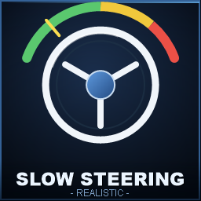

<div align="center">



# FS25 Slow Steering

**Realistische, geschwindigkeitsabhängige Lenkungs-Reduktion für Farming Simulator 25**

[](https://github.com/AMS-ABSTAND/FS25_SlowSteering/releases/latest)
[](https://www.farming-simulator.com/)
[](#lizenz)
[](#)

</div>

---

## Was macht der Mod?

Im Vanilla-FS25 lenken Fahrzeuge bei 80 km/h genauso aggressiv wie beim Rangieren. Das ist unrealistisch und fühlt sich auf Tastatur/Gamepad zwitschrig an.

**Slow Steering** koppelt den Lenkeinschlag, das Lenktempo und die Rückstellung an die Fahrgeschwindigkeit — bei Tempo wird die Lenkung weicher, präziser, und du kippst nicht mehr im ersten Kreisverkehr aus den Reifen.

| Bei langsamer Fahrt | Bei Volltempo |
|---|---|
| Volle Lenkbewegung verfügbar | Reduzierter Maximaleinschlag |
| Schnelle Reaktion | Sanftere, präzisere Eingaben |
| Schnelle Rückstellung | Verzögerte Rückstellung |
| Direkte Eingabe | Mit "Servo-Aufwand" — Lenkdauer steigt |

---

## Features

### 🎯 Realismus-Schichten

- **Geschwindigkeitsabhängige Reduktion** — Lenkwinkel, Lenktempo und Rückstellung skalieren mit dem Tempo entlang einer einstellbaren Kurve
- **Gegenlenk-Dämpfung** — Zusätzliche Reduktion beim Auslenken aus einer Kurve
- **Eingabe-Totzone** — Filtert Mikro-Wackeln raus
- **Eingabe-Kurve** — Exponentiell, sanfter in der Mitte (perfekt für Tastatur)
- **Servo-Aufwand-Simulation** — Lenkdauer wächst bei Tempo, wie ohne richtige Servohilfe
- **Bremskraft-Skalierung** — Optional Bremsen abschwächen für extra Realismus

### 🎨 Polierte In-Game-UI

- **4 Tabs** — Allgemein / Lenkung / Realismus / HUD
- **Live-Kurven-Diagramm** mit gelbem Cursor, der mit deinem aktuellen Tempo mitfährt
- **5 Presets**: Arcade · Standard · Realistisch · Simulation · Eigen
  - Werte ändern → automatischer Wechsel auf "Eigen"
- **Slider** unter jedem Wert mit Knob
- **AN/AUS-Pills** in Grün/Rot statt nur Text
- **Hilfetext** erklärt jede Einstellung
- **F1** = ausgewählten Wert auf Default · **F5** = alles aufs Profil zurück
- **Live-Vorschau** der Lenk-Kurve, die sich ändert, während du Werte verschiebst

### 📊 HUD-Anzeige

- 4 Positionen (oben/unten × links/rechts)
- Optional: farbiger Balken (grün → gelb → rot)
- Optional: Tempo-Anzeige
- Konfigurierbare Deckkraft

---

## Installation

1. **[Neueste Release-ZIP herunterladen](https://github.com/AMS-ABSTAND/FS25_SlowSteering/releases/latest)**
2. Die `FS25_SlowSteering.zip` in den Mods-Ordner legen:
   ```
   Documents/My Games/FarmingSimulator2025/mods/
   ```
3. Im Spiel im Modauswahl-Bildschirm aktivieren — fertig.

> Mehrspieler wird unterstützt. Einstellungen sind clientseitig (jeder Spieler hat seine eigene Konfiguration).

---

## Tasten-Übersicht

### Im Fahrzeug

| Taste | Funktion |
|---|---|
| `Strg + S` | Mod an/aus schalten |
| `Umschalt + S` | Einstellungs-Menü öffnen |

### Im Einstellungs-Menü

| Taste | Funktion |
|---|---|
| `↑` / `↓` | Einstellung wählen |
| `←` / `→` | Wert ändern |
| `Tab` / `E` | Nächste Kategorie |
| `Umschalt+Tab` / `Q` | Vorherige Kategorie |
| `P` | Profil durchschalten |
| `F1` | Ausgewählten Wert auf Default zurücksetzen |
| `F5` | Alle Werte auf aktives Profil zurücksetzen |
| `Enter` | Speichern und schließen |
| `Esc` / `Backspace` | Abbrechen ohne Speichern |

---

## Presets

| Preset | Wofür |
|---|---|
| **Arcade** | Minimale Reduktion, knackige Reaktion. Wer Vanilla mag, mit nur leichtem Speed-Touch. |
| **Standard** | Spürbare Reduktion ohne aufdringlich zu wirken. Guter Mittelweg. |
| **Realistisch** ⭐ | Default. Realitätsnah ohne überzogen. Empfohlen. |
| **Simulation** | Volle Härte. Servo-Aufwand, lange Rückstellung — am nächsten dran an einem echten Schlepper bei Transportgeschwindigkeit. |
| **Eigen** | Wird automatisch aktiv, sobald du irgendeinen Wert von einem Preset abänderst. |

---

## Konfiguration

Die Konfiguration liegt unter:

```
Documents/My Games/FarmingSimulator2025/modsSettings/FS25_SlowSteering/settings.xml
```

Du kannst sie auch direkt im XML editieren — die Werte werden beim Laden auf gültige Bereiche begrenzt. Das Menü ingame ist aber bequemer.

### Wichtige Werte

| Schlüssel | Bereich | Beschreibung |
|---|---|---|
| `refSpeed` | 5–200 km/h | Geschwindigkeit, bei der die volle Reduktion erreicht wird |
| `steeringReductionAtRef` | 0.01–0.95 | Anteil der Lenkreduktion bei `refSpeed` (z.B. 0.55 = 55 %) |
| `counterSteerReduction` | 0–0.95 | Zusätzliche Dämpfung beim Gegenlenken |
| `returnSlowdown` | 0.01–0.99 | Verlangsamung der Rückstellung bei Tempo |
| `curveExponent` | 0.5–3.0 | Form der Kurve (>1 = sanft niedrig, aggressiv hoch) |
| `deadzone` | 0–0.30 | Eingabe-Totzone |
| `inputCurve` | 1–3 | Exponent der Eingabe-Kurve |
| `powerSteeringEffort` | 0–0.90 | Servo-Aufwand bei Tempo |
| `brakeForceMultiplier` | 0.05–1.0 | Bremskraft-Skalierung |

---

## Wie es technisch funktioniert

Der Mod hängt sich als Spezialisierung an alle Fahrzeuge mit `Motorized + Drivable + Enterable`. Modifiziert wird:

| FS25-Property | Effekt |
|---|---|
| `Drivable:setSteeringInput()` | Eingabewert wird vor Weitergabe gefiltert (Totzone, Kurve, Reduktion, Gegenlenk-Dämpfung) |
| `self.maxRotTime` / `minRotTime` | Begrenzt den maximalen Lenkeinschlag bei Tempo |
| `self.wheelSteeringDuration` | Verlangsamt die Lenkbewegung (Servo-Aufwand) |
| `self.autoRotateBackSpeed` | Verlangsamt die Rückstellung |
| `motor.brakeForce` | Optional skaliert |

Beim Deaktivieren oder Verlassen werden alle Originalwerte wiederhergestellt — null bleibender Schaden, falls du den Mod entfernst.

---

## Kompatibilität

- ✅ Funktioniert mit allen Vanilla-Fahrzeugen
- ✅ Sollte mit den meisten Mod-Fahrzeugen funktionieren (alles mit Standard-Drivable)
- ✅ Multiplayer-tauglich
- ⚠️ Wenn ein anderer Mod ebenfalls `setSteeringInput` überschreibt, gewinnt der zuletzt geladene

---

## Aufbau des Repos

```
FS25_SlowSteering/
├── modDesc.xml          # Mod-Metadaten, Hotkeys, l10n
├── register.lua         # Spezialisierungs-Registrierung, Listener
├── SlowSteering.lua     # Engine + HUD + Config + Presets
├── SlowSteeringGui.lua  # Tab-UI mit Live-Kurven-Vorschau
└── icon.png             # 256×256 Mod-Icon
```

---

## Ein Bug aufgefallen?

Issues sind willkommen → [GitHub Issues](https://github.com/AMS-ABSTAND/FS25_SlowSteering/issues)

Bitte mit dabei:
- FS25-Version
- Mod-Version (siehe `modDesc.xml`)
- Beschreibung was passiert vs. was passieren sollte
- Auszug aus der `log.txt` (`Documents/My Games/FarmingSimulator2025/log.txt`), falls Fehler

---

## Lizenz

MIT — siehe Repo. Du darfst den Code frei verwenden, anpassen und weiterverteilen, solange die Original-Lizenz erhalten bleibt.

---

<div align="center">

**Viel Spaß auf dem Acker — fahr vorsichtig 🚜**

</div>
